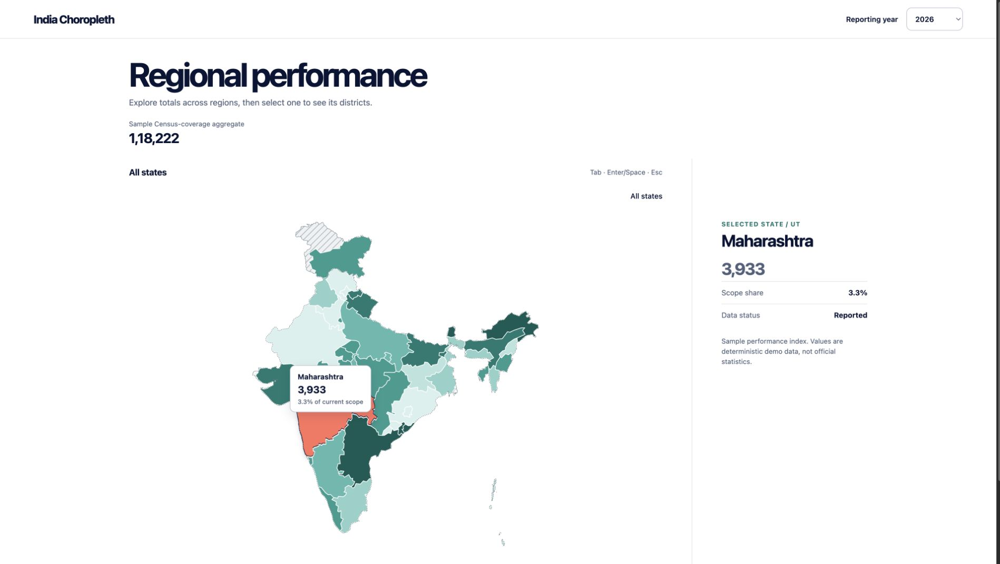
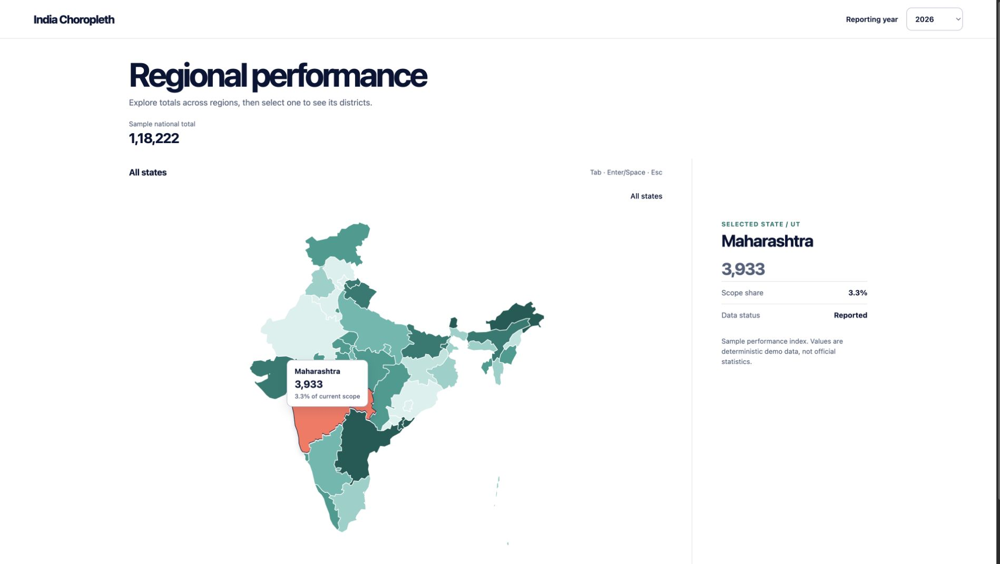
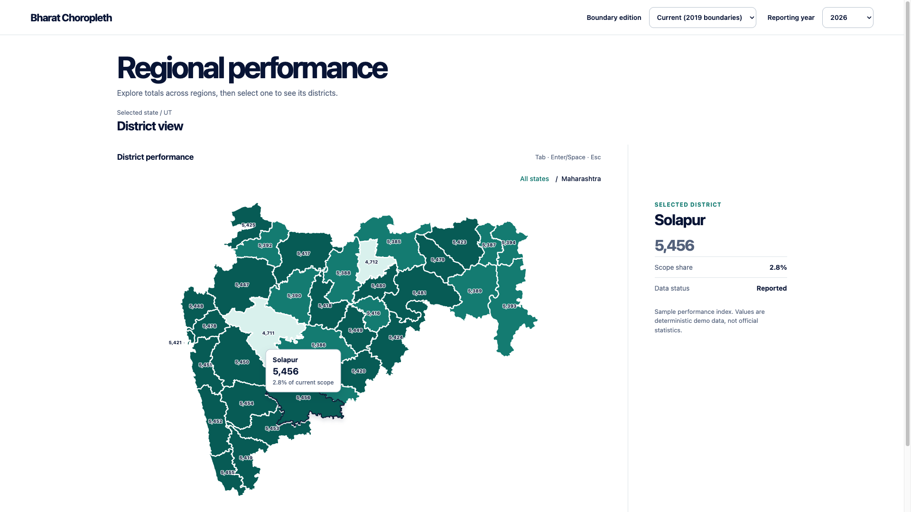
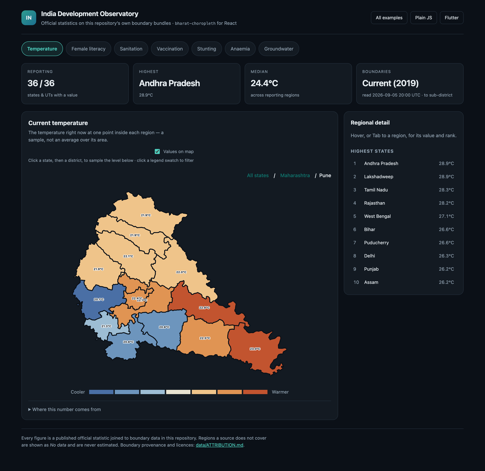
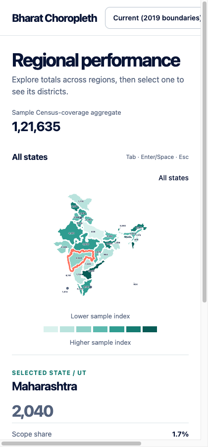

# Bharat Choropleth

`bharat-choropleth` is an open-source React renderer for accessible India state-to-district choropleths — a zero-config `BharatChoropleth` component over a full `IndiaChoropleth` renderer — with a framework-free `bharat-choropleth-js` port for non-React use — same behavior, same CSS, either an ES module or a single `<script>` tag. A native `bharat_choropleth` Flutter package provides the same map interaction without a WebView, and the Python `bharat_choropleth` package produces static SVG or optional Matplotlib output. This workspace also includes a separately documented, historical Census-2011 state/UT-to-district boundary bundle for the reference implementation.

The package turns a state GeoJSON/TopoJSON layer into an accessible SVG map, then loads a selected state's district layer on demand — and, below that, a selected district's sub-districts (tehsils / taluks / mandals / blocks). It follows the approved Atlas UX: hover/focus inspection, activation/drill-down, a breadcrumb return, optional legend and host-owned insight content. The legend also filters — picking a swatch highlights the regions painted in it and dulls the rest, picked again or Escape to clear.



**[Try the live demo →](https://shashankbudem.is-a.dev/bharat-choropleth/)** — the
same dashboard built three times, once per ecosystem, on published Indian
statistics plus a live temperature feed that drills to sub-district.

## Examples

### National view



### District drill-down



Activating a district goes one level further, into its sub-districts — see [Sub-district drill-down](#sub-district-drill-down).

### Sub-district level, on live data



The third level, in the [observatory example](./examples/observatory). Published
statistics stop at district — a figure is collected on particular administrative
units, and drawing a 2011 one on 2019 outlines would misstate which places were
measured — so the indicator that reaches sub-district is read live from a weather
API, which has no vintage and answers for a coordinate.

### Responsive layout



## Package layout

```text
packages/react    React: zero-config `<BharatChoropleth values={...} />` over the full `IndiaChoropleth` renderer
packages/js       Framework-free library: `new BharatChoropleth("#map")` from a <script> tag, or ESM
packages/flutter  Native Dart/Flutter renderer (CustomPainter) — full parity with the web packages, no WebView
packages/python   Dependency-light Python renderer: accessible SVG by default, optional Matplotlib
data              Reproducible Census-2011 boundary preparation, manifest, and attribution
apps/demo         Documentation/demo application using the included historical bundle
```

`pnpm check` covers the JavaScript workspace only. The Flutter and Python packages are independently packaged — run `pnpm check:flutter` for the Dart one, and the Python checks from `packages/python`.

The Flutter example's boundary assets are generated data and are not committed, so a fresh clone has an empty `packages/flutter/example/assets/`. `pnpm check:flutter` and `pnpm build:pages` populate it themselves; run `pnpm prepare:flutter-assets` by hand before invoking `flutter` directly. Without it `flutter analyze` exits non-zero on the missing asset directory.

## Availability

Version `0.3.0` is published for all four packages.

| Target | Package | Registry | Source |
| --- | --- | --- | --- |
| React | [`bharat-choropleth@0.3.0`](https://www.npmjs.com/package/bharat-choropleth) | npm | [`packages/react`](./packages/react) |
| Plain JavaScript | [`bharat-choropleth-js@0.3.0`](https://www.npmjs.com/package/bharat-choropleth-js) | npm | [`packages/js`](./packages/js) |
| Flutter | [`bharat_choropleth@0.3.0`](https://pub.dev/packages/bharat_choropleth) | pub.dev | [`packages/flutter`](./packages/flutter) |
| Python | [`bharat-choropleth@0.3.0`](https://pypi.org/project/bharat-choropleth/) | PyPI | [`packages/python`](./packages/python) |

Install with:

```bash
# React
npm add bharat-choropleth

# Framework-free JavaScript
npm add bharat-choropleth-js

# Flutter
flutter pub add bharat_choropleth

# Python
pip install bharat-choropleth
```

Maintainers: see [Publishing the packages](./docs/PUBLISHING.md) for the release checklist. Do not put registry credentials in this repository or in committed configuration.

## Persistent hosted parity demos (Cloudflare Pages)

Build the three current-vintage parity demos as one static Cloudflare Pages
artifact; unlike a Quick Tunnel, it remains online after the local
`cloudflared` process exits:

```bash
pnpm install --frozen-lockfile
pnpm build:pages
pnpm dlx wrangler@4 login
pnpm dlx wrangler@4 pages project create bharat-choropleth-demos --production-branch main
CLOUDFLARE_PAGES_PROJECT_NAME=bharat-choropleth-demos pnpm deploy:pages -- --branch=main
```

The artifact is `dist/cloudflare-pages/`, with stable `/react/`, `/js/`, and
`/flutter/` routes. A Direct Upload project is separate from Cloudflare Pages
Git integration; use a separate Git-integrated project if automatic GitHub or
GitLab builds are needed.

The code and boundary data have different licences. The React renderer is MIT licensed. The included Census-2011 geometry is derived from DataMeet’s district dataset and is licensed CC BY 2.5 India; it requires attribution and is not a current administrative register. See [data/README.md](./data/README.md), [data/ATTRIBUTION.md](./data/ATTRIBUTION.md), and [the generated manifest](./data/generated/census-2011/manifest.json) before redistributing it.

An optional political-claim context overlay is a separate contemporary DataMeet state-derived asset, attributed under DataMeet’s CC BY 4.0 repository terms and checked against the [Survey of India political-map depiction](https://surveyofindia.gov.in/pages/political-map-of-india). It is a non-statistical reference layer—not Survey of India geometry, not a statement of administrative control, and not an input to any metric or total. The package does not reproduce or redistribute Survey of India geometry; see [the boundary-source note](./data/official-outline.md).

An optional current-vintage state/UT and district bundle (`data/generated/current-2019-states/` and `data/generated/current-2019-districts/`) is a separately versioned, MIT-licensed asset derived from [`datta07/INDIAN-SHAPEFILES`](https://github.com/datta07/INDIAN-SHAPEFILES) — the same source and commit used by [india-map-studio](https://github.com/nikhilsawantse/india-map-studio). It has 36 fully interactive, value-bearing current state/UT regions (including Jammu & Kashmir and Ladakh as separate UTs) with no separate reference-overlay treatment needed at that level, plus a full 788-district drill-down and a 5,950-feature sub-district level beneath it, and is not joined to the Census-2011 bundle by id or name. Two Pakistan-administered J&K district features (Mirpur, Muzaffarabad) are excluded from the value-bearing set and rendered as a non-interactive reference overlay instead, for the same reason the historical bundle never assigns a value to claimed-but-unadministered territory. See [data/README.md](./data/README.md#optional-current-vintage-stateut-bundle).

## Design decisions

- Stable feature IDs are mandatory. The included historical bundle uses deterministic Census-derived IDs; for consumer-supplied contemporary geometry, use its stable identifiers (prefer LGD codes where available). Display names are only labels.
- The `MapLayer` requires explicit ID, label, and value accessors. It does not assume a provider's property names or a business metric.
- `drillDownId`, `subDistrictDrillDownId` and `selectedId` support controlled usage; `defaultDrillDownId`, `defaultSubDistrictDrillDownId` and `defaultSelectedId` are the ergonomic uncontrolled path. A district id means nothing outside its state, so changing `drillDownId` clears the level below it.
- `loadDistricts` is lazy and runs only after state activation. The host can use a dynamic import, fetch, or local cache. `loadSubDistricts` is the same one level down, and may return `null` for a district that has no sub-district level — that district is left as a leaf rather than opening an empty view, and stops offering the level once it has answered. Without the loader, a district is a leaf and activation only selects it.
- Geometry accepts GeoJSON `FeatureCollection` or TopoJSON with an object key. `d3-geo` projects each level into a responsive SVG viewBox.
- `referenceOverlay` accepts separate national-only reference geometry—such as an outline or claimed area—that must never be coloured, selected, drilled into, or counted. It renders in a neutral hatch; the host provides its exact accessible description instead of the renderer assuming the whole outline lacks data.
- Tooltip and insight UI are slots. Default copy contains only generic data concepts; a dashboard owns its metric/year wording and surrounding chrome.
- Regions are keyboard focusable and activate with Enter/Space. Focus and pointer hover have the same inspection callback. CSS includes a reduced-motion mode and public CSS variables.

## Without a framework: one script tag

For plain JavaScript — or any framework that can load a plain JS library — [`bharat-choropleth-js`](./packages/js) needs a single script tag and no build step:

```html
<div id="map"></div>
<script src="https://cdn.jsdelivr.net/npm/bharat-choropleth-js@0.3.0"></script>
<script>
  var map = new BharatChoropleth("#map");
  map.fontColor = "maroon";
  map.goa = 6;
  map.gujarat = 7;
</script>
```

The stylesheet is injected by the script, boundary data is fetched on construction (never bundled — set `dataBaseUrl` to self-host), and values written before it arrives are applied when it does. Clicking a state drills into its districts, and a district into its sub-districts. See [packages/js/README.md](./packages/js/README.md).

## React install

```bash
pnpm add bharat-choropleth
```

Import the default stylesheet once:

```ts
import "bharat-choropleth/style.css";
```

## React: one prop

`BharatChoropleth` is the React counterpart of the script-tag facade above — map
state names to numbers and you have a map, with boundary data fetched for you and
drill-down already wired:

```tsx
import { BharatChoropleth } from "bharat-choropleth";
import "bharat-choropleth/style.css";

export function Map() {
  return (
    <BharatChoropleth
      values={{
        Telangana: 82,
        Karnataka: 74,
        Maharashtra: 91,
      }}
    />
  );
}
```

Keys resolve through the same state registry the JavaScript facade uses, so
`Goa`, `goa`, `tamilnadu`, `Jammu & Kashmir`, `Orissa` and `in-cs-30-goa` all
land where you would expect; an unrecognized name is ignored with a warning
rather than throwing. Row-shaped data works too, via
`data` + `regionKey` + `valueKey`, and district numbers nest under their state
with `districtValues={{ Telangana: { Hyderabad: 90 } }}`. Every `IndiaChoropleth` prop except `states`
passes straight through. See [packages/react/README.md](./packages/react/README.md).

## Minimal usage

Everything below uses `IndiaChoropleth`, the core renderer that
`BharatChoropleth` wraps. Use it directly when you own the geometry — it is the
full API and is not going anywhere.

```tsx
import { IndiaChoropleth, type MapLayer } from "bharat-choropleth";
import "bharat-choropleth/style.css";
import census2011States from "./data/generated/census-2011/states.topo.json";

const stateLayer: MapLayer = {
  geometry: { topology: census2011States, object: "states" },
  getId: (feature) => String(feature.properties?.id),
  getLabel: (feature) => String(feature.properties?.name),
  getValue: (feature) => valuesById[String(feature.properties?.id)] ?? null,
};

export function Map() {
  return (
    <IndiaChoropleth
      states={stateLayer}
      loadDistricts={async (stateId, state) => {
        const module = await import(`./data/generated/census-2011/districts/${stateId}.topo.json`);
        return {
          geometry: { topology: module.default, object: "districts" },
          getId: (feature) => String(feature.properties?.id),
          getLabel: (feature) => String(feature.properties?.name),
          getValue: (feature) => valuesById[String(feature.properties?.id)] ?? null,
        };
      }}
      formatValue={(value) => new Intl.NumberFormat("en-IN").format(value)}
      renderTooltip={({ label, value, share }) => (
        <><strong>{label}</strong><b>{value ?? "No data"}</b><small>{share?.toFixed(1)}% share</small></>
      )}
    />
  );
}
```

## Controlled drill-down

```tsx
const [drillDownId, setDrillDownId] = useState<string | null>(null);

<IndiaChoropleth
  states={stateLayer}
  drillDownId={drillDownId}
  onDrillDownChange={setDrillDownId}
  loadDistricts={loadDistrictLayer}
/>
```

## Sub-district drill-down

A third level below districts. `loadSubDistricts` receives the district ID, the
district region, and the state ID it sits in:

```tsx
<IndiaChoropleth
  states={stateLayer}
  loadDistricts={loadDistrictLayer}
  loadSubDistricts={async (districtId) => {
    const module = await import(`./data/generated/current-2019-subdistricts/subdistricts/${districtId}.topo.json`)
      .catch(() => null);
    // No asset means this district has no sub-district level — leave it a leaf.
    if (!module) return null;
    return {
      geometry: { topology: module.default, object: "subdistricts" },
      getId: (feature) => String(feature.properties?.id),
      getLabel: (feature) => String(feature.properties?.name),
      getValue: (feature) => valuesById[String(feature.properties?.id)] ?? null,
    };
  }}
/>
```

The bundled current-vintage sub-district layer has 5,950 sub-districts across 785 of
the 788 districts. Three districts deliberately have no asset — Delhi's Nazul, which is
a land-tenure artifact rather than a district, and Rajasthan's urban Jaipur and Jodhpur,
whose source polygons sit inside their own rural halves. See
[data/README.md](./data/README.md#optional-current-vintage-sub-district-bundle).

## Non-statistical national reference geometry

Keep any non-statistical claim or outline separate from state metrics. This API deliberately has no value accessor, so it cannot accidentally inherit a choropleth colour or aggregate.

```tsx
<IndiaChoropleth
  states={stateLayer}
  referenceOverlay={{
    geometry: referenceGeoJson,
    getId: (feature) => String(feature.properties?.id),
    getLabel: (feature) => String(feature.properties?.name),
    getDescription: () => "National reference outline; hatched portions outside the statistical layer have no data.",
  }}
/>
```

The overlay appears only at the national level. Its neutral hatch and legend key distinguish it from reportable regions; it is non-interactive and exposed to assistive technology with the host-provided coverage context.

## District reference context

When an historic district layer needs a newer non-statistical context outline, load it only for the matching parent ID. The overlay is independently fetched, stale-safe, shares the district projection, and is unavailable as a metric or a drill-down target.

```tsx
<IndiaChoropleth
  states={stateLayer}
  loadDistricts={loadDistricts}
  loadDistrictReferenceOverlay={async (stateId) => {
    if (stateId !== "historical-parent-id") return null;
    return { geometry: historicalContextGeometry, getId, getLabel, getDescription };
  }}
/>
```

When controlled, update `drillDownId` in `onDrillDownChange`; the callback is a notification, not an internal override. The same controlled/uncontrolled convention applies to selection.

## Commands

```bash
pnpm install
pnpm typecheck
pnpm test
pnpm build
pnpm build:data # requires the pinned DataMeet source checkout; not part of pnpm check
pnpm build:demo
pnpm validate:data

# Runs all of the above release checks.
pnpm check

# Release preflight: fetches one asset per level from the pinned data source.
# Network-dependent, so deliberately outside pnpm check.
pnpm verify:data-pin

# Rebuilds the fixture that holds the Dart state registry to the TypeScript one.
# Only needed after changing packages/js/src/states.ts.
pnpm generate:state-cases

# The Dart package is checked on its own; this populates the example's
# gitignored boundary assets first, which analyze needs to exist.
pnpm check:flutter

# Populate packages/flutter/example/assets from data/generated on its own.
pnpm prepare:flutter-assets
```

## Release status

All four packages are published at `0.3.0` — see [Availability](#availability) for the registry links. Future releases follow the [publishing guide](./docs/PUBLISHING.md); increment a package's version before publishing because registries do not permit reusing one, and run `pnpm verify:data-pin` so the release does not repeat the 0.2.0 mistake of shipping a renderer whose default data source predates the level it renders. The boundary datasets are deliberately not published as a single generic dependency: preserve each generated bundle's manifest, source attribution and licence when redistributing it.
